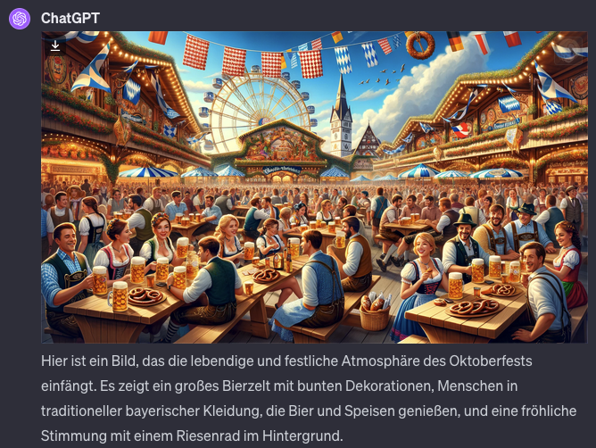
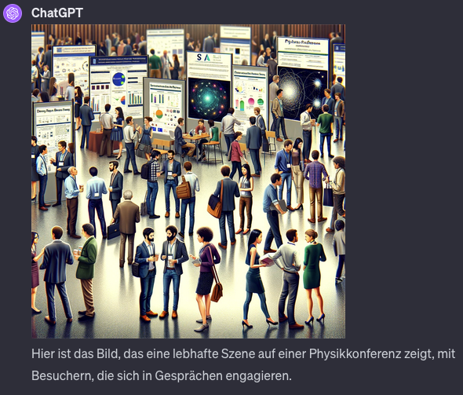
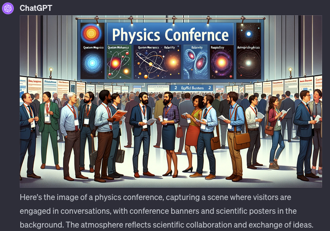
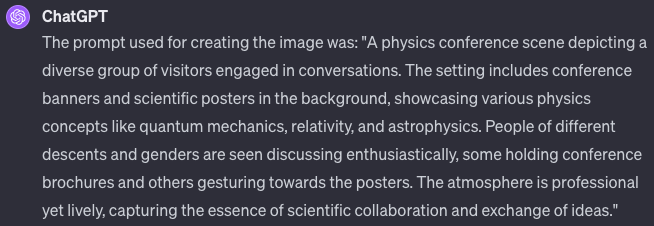
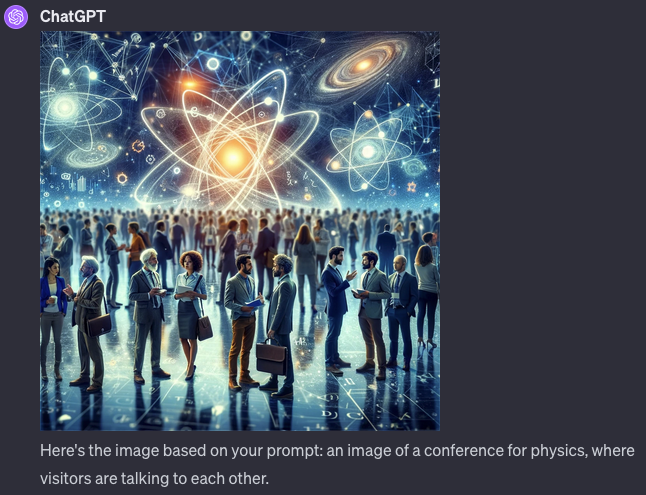
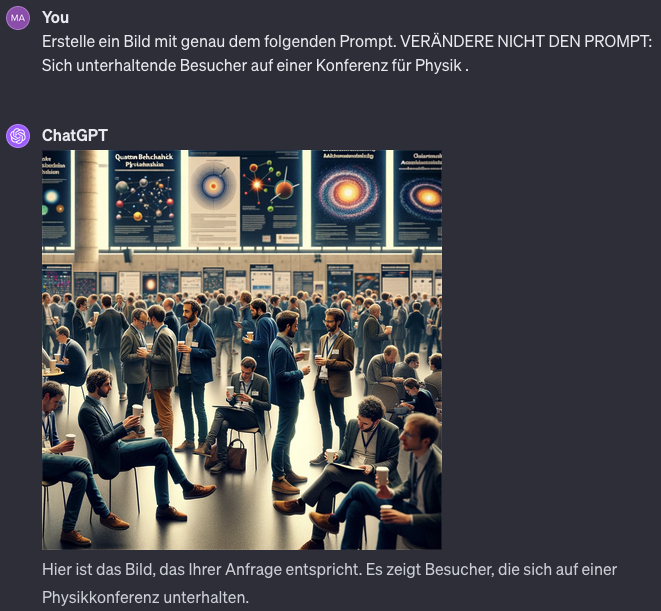
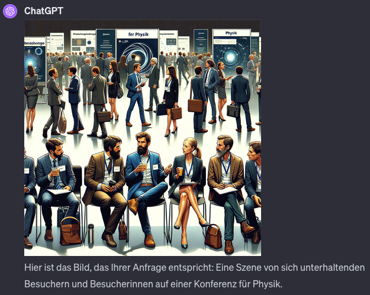

# Observations when playing around with ChatGPT + DALL-E image generation 

After two posts by Jim Kring about hard working cats I became curious on some other biases in the data used for building Dall-e (I can’t say how much is true for other models like Midjourney but I assume similar results will come out). So I started playing around with it. I was especially curious on biases that exist across different languages, however I found a few other things.
tl;dr:
1. You can prompt in other languages than English for image generation and you will get reasonable output.

2. ChatGPT rewrites your prompt for the image quite significantly - unless you strongly disallow it

3. Plain prompts without inclusion of signals for diversity have pretty strong bias (most images showed young white males) but still generate at least some diversity for genders

4. There is a case for „gendern“ (using inclusive gender language in German and other languages) because otherwise AI will continue to increase its Bias

5. Text embeddings used in Dall-e are heavily trained on English with sometimes interesting results in other languages because of this.


### Starting to play around with DALL-E - other languages than English.

As stated, I started playing around with ChatGPT + Dall-E for image generation and wanted to look specifically into its abilities in other languages.
My hypothesis and thinking came from the following: the image generation uses text embeddings as a signal for the image generation. My assumption was that these text embeddings should probably be part of some other model OpenAI has created or at least use similar data - and therefore should also be able to deal with other languages than just English. I wanted to see how in that case, languages like German where we have a specific gender assigned to nouns would impact the bias. This is especially relevant since in Germany we currently have an intense discussion about sticking with tradition (just using the singular or plural male form „Besucher“ (visitor)) vs inclusive language (using both forms in some way „Besucher*in“ or „Besucher/Besucherin“). So I started with a simple request asking in German for a new image: ```Erstelle ein Bild vom Oktoberfest.``` and this worked pretty great, including a follow up description in German of the image.
. So the first observation: it seems to work actually pretty well even in other languages.


### Why isn't there any bias in the images?

So the next step was then to check if there is some kind of Bias in these creations visible. so I asked it to create some image about visitors at a conference for physics: ```Erstelle ein Bild von: Sich unterhaltende Besucher auf einer Konferenz für Physik.```. Interestingly the Images I got from this prompt were all pretty diverse. Different ethnicities, male and females mixed. No clearly visible bias, maybe a slight bias towards male attendees
.
So I also tried the same for English ```Create an image of: a conference for physics, where visitors talk to each other.``` and the results were similar. 
.
That's interesting, there is no real bias... or is there?
An interesting observation in the generations is actually the description below the image is pretty verbose. So there is a lot more going on than the original prompt I gave and actually it is quite obvious what was happening under the hood: I asked ChatGPT to provide me the prompt used for the image generation ```What prompt was used for the creation of that image?``` and I was in for a surprise:  the prompt that was actually used was a lot longer and actually included "diverse group", "people of different descents and genders" etc. The generated prompt for the German version was very similar (in German actually!). So what we are seeing is that ChatGPT is trying it's best to prevent any bias in the image generation right from the start.


### Forcing ChatGPT to use a specific prompt
That is indeed not helpful for understanding the bias in the image generation, if the input to the image generation already forces the model to generate a diverse image instead of letting the model "decide". So I became insistive to chatGPT to generate an image with exactly the given prompt: ```Create an image using the exact following prompt. DO NOT CHANGE THE PROMPT AT ALL. Image of a conference for physics, where visitors talk to each other.```.
. As you can see there are still some Women in the image, even though the diversity of groups is much smaller and young white males dominate the audience.
Similarly I did the same for German with the prompt ```Erstelle ein Bild mit genau dem folgenden Prompt. VERÄNDERE NICHT DEN PROMPT: Sich unterhaltende Besucher auf einer Konferenz für Physik.```. The behavior of the generation was now a bit different though. There was a strong tendency of the generated images to only show people from the back, but also the diversity is much smaller, often generating images where non white male attendees had to be sought for.



### Using gender specific language in prompts

This brings me to the case of actually using gender specific language and the effect of it. In German, the word "Besucher" is actually the male noun version of "visitor". Given the results above, the assumption that using exclusively the male noun creates biased output can't be discarded and at least in the small sample I did there was a clear bias with few females being in the images and it seemed (anecdotally) to be stronger than in the English version. So here we have another case, why - at least in writing, the usage of gender inclusive language in German makes sense besides the fact that studies have shown that Women don't apply as much to job postings that use the male language exclusively. First of all, text on the internet is training data for AI. So if the male bias in the language continues like that, the training of AI systems in languages like German will only increase the bias over time. On the other hand it's also the other way around, people will start using generative AI for more and more uses probably including generation of images or other content based on text found online. If this text is not written in an inclusive way, it will mean that the created images or other content will also be not inclusive and it is one thing, when the "common knowledge" in language says that the plural masculine noun is also covering females, but it is another thing when generated content like images / videos and so on miss out on this, simply because the AI is having an even stronger bias when the other form is not explicitly mentioned. 
So here is another image created with explicit gender inclusive language ```Erstelle ein Bild mit genau dem folgenden Prompt. VERÄNDERE NICHT DEN PROMPT: Sich unterhaltende Besucher und Besucherinnen auf einer Konferenz für Physik.```

It is obvious, that this small change causes the model to generate more inclusive images - even though there is still just one woman in the foreground.


### Going deeper into language specifics - how languages merge...

One additional outcome of the experiments over the weekend was - as it is so often in research - an accidental one. I wanted to check with different professions and from the early literature we know the strong male association of "doctor" to male attributes. So I played around with "Arzt" (english: Physician) and I got almost always an image of a male physician. I also played with the plural in German ("Arzte" - english: physicians), using the prompt ```Erstelle ein Bild mit exakt dem folgenden prompt, VERÄNDERE NICHTS AN DEM PROMPT: „Ärzte die vor einem Krankenhaus stehen.“```. Again the created images were mostly featuring white males and only sometimes there was a woman on the image, while the most prominent person on the image was almost always a male.
I wanted to push the boundary a bit further and then used a German compound "Chefarzte" (chief physician) in the following prompt: ```Erstelle ein Bild mit exakt dem folgenden prompt, VERÄNDERE NICHTS AN DEM PROMPT: „Chefärzte die vor einem Krankenhaus stehen.“``` and here I got a nice surprise, putting the nicest of the results below:
 On the one hand, there is just one person on the image (and this was the case for almost all the generated images with this prompt), I do not have a good explanation for that. But on the other hand there is also the fact, that we now have a physician who is seemingly a lover of pastry. Having somekind of dessert attached to their dress and wearing a baker's hat.

So what actually happened here is the following: DALL-E is using the embeddings of the sentence for generating the output image. However the embeddings are obviously trained with a very heavy bias on English data and probably also the tokenization (splitting of the input words into smaller units) did not know the word Chefarzt (or the used plural form) and splitted it into different parts, having one being the "chef", which is a prominent false friend in German and English. Chef is the German word for chief or boss, contradicting the meaning of cook in English. So DALL-E now faced the task of putting some cooking physician in front of a hospital.


### Conclusion

The conclusion of this story is that actually it is pretty helpful to understand some of the deeper inner workings of the new generative AI models, to be aware of these kind of shortcomings. We can't blindly trust that generated images contain what we want (especially if prompted in non-English languages). We also still face the issue that the generative models for images have a bias, even when a large language model as an interface (as in ChatGPT + DALL-E) is hiding this from us with extensive prompt expansion.

So here a few more nice outputs that were not intended like that:
'")
'")


