# Trying out Bayesian inference with PyMC3 on covid data

 _Disclaimer: this is in no way intended to be relied on!_
 _I'm neither an expert in pandemics, and I'm just trying to understand and learn Bayesian Inference better.
 This was done purely for me to learn something new_
 
It doesn't respect reactions of the countries, it doesn't respect the testing capabilities / numbers in the countries, it doesn't respect real biological models and past research in the field of virology and pandemics.


```python
import pymc3 as pm
import numpy as np
import matplotlib.pyplot as plt
from matplotlib.ticker import StrMethodFormatter
import seaborn as sns
import pandas as pd
import theano
%matplotlib inline
import warnings
from scipy.stats import halfnorm
warnings.filterwarnings('ignore')
```

    WARNING (theano.tensor.blas): Using NumPy C-API based implementation for BLAS functions.


### Data based on a dump from a wiki page offering country specific infections.

Data is a snapshot form Kaggle taken from around mid April 2020 and wasn't updated since!

To make the data more representative, days before 2000 infections were reached were removed, since there might have been just single hotspots that were under control, also only those timeseries were looked at, that had in it's current state more than 20.000 infections counted.
Furthermore the data was restricted to series of at least 10 days.
These restrictions allow to look at a smaller set.


```python
infections = []
countries = {}

MIN_DATES = 10

with open('untitled1.txt', 'r') as csv:
    intermediate = []
    counter = 0
    
    for line in csv:
        
        line = line.strip().split(',')
        country = line[2]+'-'+line[1]
        infection = int(float(line[4]))
        deaths = int(float(line[5]))
#        print(line)
                
        if infection < 2000:
            continue
        if not country in countries:
            countries[country] = 0
            counter = 0
            if len(intermediate) > MIN_DATES and intermediate[-1][2] > 20000:
                for i in intermediate:
                    infections.append(i)
                
            intermediate = []
        counter += 1
        intermediate.append([country, counter, infection, deaths])
    if len(intermediate) > MIN_DATES:
        for i in intermediate:
            infections.append(i)


        
full_df = None
full_df = pd.DataFrame(infections, columns=['country', 'day', 'infections', 'deaths'])
full_df = full_df.astype({'day': 'int32', 'infections': 'int32', 'deaths': 'int32'})

#filters = full_df.country.apply(lambda x: x in [
#        'China', 'Germany', 'Japan', 'South Korea', 'France', 'Netherlands'])
#full_df=full_df[filters]
countries = full_df.country.values
uniq_countries = full_df.country.unique()
n_countries = len(uniq_countries)

full_df['country_idx'] = [list(uniq_countries).index(x) for x in countries]
#print(full_df.country_idx)
#print(full_df)
print(list(enumerate(uniq_countries)))
```

    [(0, 'Belgium-'), (1, 'Brazil-'), (2, 'Canada-Quebec'), (3, 'China-Hubei'), (4, 'Ecuador-'), (5, 'France-'), (6, 'Germany-'), (7, 'India-'), (8, 'Iran-'), (9, 'Italy-'), (10, 'Netherlands-'), (11, 'Peru-'), (12, 'Portugal-'), (13, 'Russia-'), (14, 'Spain-'), (15, 'Switzerland-'), (16, 'Turkey-'), (17, 'US-California'), (18, 'US-Connecticut'), (19, 'US-Florida'), (20, 'US-Georgia'), (21, 'US-Illinois'), (22, 'US-Louisiana'), (23, 'US-Massachusetts'), (24, 'US-Michigan'), (25, 'US-New Jersey'), (26, 'US-New York'), (27, 'US-Pennsylvania'), (28, 'US-Texas'), (29, 'United Kingdom-')]


### here is the modeling part

the base idea is to fit a sigmoid like function to model the number of total infections. This assumption alone is probably already enough reason to not trust any output of this model. So _please don't trust_ the model.

Instead of using the regular sigmoid, I chose the _Gompertz Function_:

\begin{equation}
\large{
f(x) = a \cdot e^{b \cdot e^{c \cdot x} }
}
\end{equation}

The reason for using the Gompertz function is it's assymmetrie, allowing to adjust for the exponential increase ans slow down phases.
with $b, c < 0$ the value of $a$ determines the upper limit and therefore in our investigation the upper limit of infections.
$b$ and $c$ determine the speeed and acceleration.

To have some benefit from all the past countries, I tried to model $b$ and $c$ hierarchical, having a "mean value" across all time series, and the individual time series deviates from this according to a small normal distribution. The idea is, to have estimates for how things will develop even when very little hints are in the data.


```python
from theano import shared
predictors = full_df.day.values.copy()
predictors_shared = shared(predictors)
country_id = full_df.country_idx.values.copy()
country_idx = shared(country_id)


from theano import shared
predictors = full_df.day.values.copy()
predictors_shared = shared(predictors)


import scipy
with pm.Model() as model:
    
    a = pm.Uniform('a', lower=1000, upper=1000000, shape=n_countries)
    b_base = pm.Uniform('b_base', lower=-8, upper=-3)
    b = pm.Normal('b', mu=b_base, sigma=1, shape=n_countries)
    c_base = pm.Uniform('c_base', lower=-1, upper=-0.00001)
    c = pm.Normal('c', mu=c_base, sigma=0.03, shape=n_countries)
    
    y = (a[country_idx] * pm.math.exp(b[country_idx] * pm.math.exp(c[country_idx] * (predictors_shared))))
    obs = pm.Normal('obs', mu=y, sigma=5000, observed=full_df.infections.values)

    trace = pm.sample(20000, cores=2)
    
```

### Now plotting the results of the fittings

The fittings did not work out very well, we will see why when we look at the traces.

We can see some pretty wide confidence intervals, so like the output suggested it didn't work out too well.
Interestingly this is especially then the case, when the counts haven't turned into the slow down phase where the infections are under control. This also makes sense, because the model has to guess which kind of behavior it will see when the infections get under control, without having any hints on it.
But here is the hierarchical model at least helping a bit, interpolating from overal behavior of the infections to the individual case.


```python
from pymc3 import forestplot

plt.figure(figsize=(20,20))
forestplot(trace, var_names=['a'])
forestplot(trace, var_names=['b'])
forestplot(trace, var_names=['c'])

pm.traceplot(trace)
print(list(enumerate(uniq_countries)))
```

    [(0, 'Belgium-'), (1, 'Brazil-'), (2, 'Canada-Quebec'), (3, 'China-Hubei'), (4, 'Ecuador-'), (5, 'France-'), (6, 'Germany-'), (7, 'India-'), (8, 'Iran-'), (9, 'Italy-'), (10, 'Netherlands-'), (11, 'Peru-'), (12, 'Portugal-'), (13, 'Russia-'), (14, 'Spain-'), (15, 'Switzerland-'), (16, 'Turkey-'), (17, 'US-California'), (18, 'US-Connecticut'), (19, 'US-Florida'), (20, 'US-Georgia'), (21, 'US-Illinois'), (22, 'US-Louisiana'), (23, 'US-Massachusetts'), (24, 'US-Michigan'), (25, 'US-New Jersey'), (26, 'US-New York'), (27, 'US-Pennsylvania'), (28, 'US-Texas'), (29, 'United Kingdom-')]


    <Figure size 1440x1440 with 0 Axes>


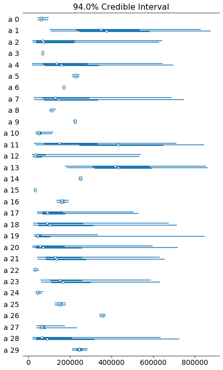


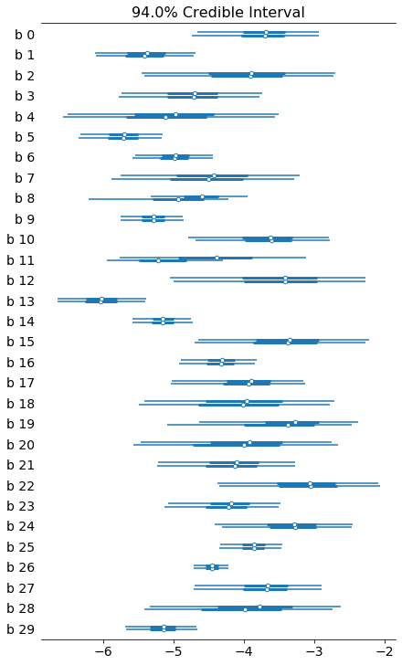


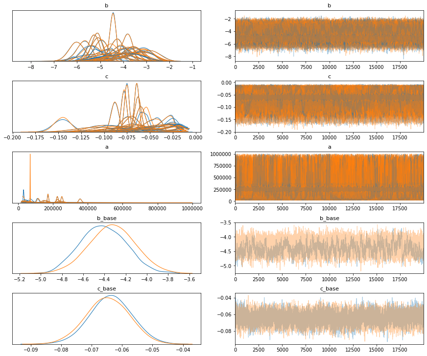


### now predicting the future...

the traceplot above show what we already assumed, had some issues, especially the base values of c and b didn't fully converge to a single distribution, normally you would do a reparametrization and probably increase tuning steps to fix this.
But still let us try to now use the found model parameters to simulate how it's going to continue.


```python
#ppc = pm.sample_posterior_predictive(trace, samples=500, model=model)
x = np.tile(np.linspace(1, 100, 100).astype('int32'), n_countries)
print(len(x))
predictors_shared.set_value(x)

y = np.repeat(np.linspace(0,n_countries-1,n_countries).astype('int32'), 100)
print(len(y))
country_idx.set_value(y)

with model:
    post_pred = pm.sample_posterior_predictive(trace, samples=10000)
```

      0%|          | 35/10000 [00:00<00:28, 345.46it/s]

    3000
    3000


    100%|██████████| 10000/10000 [00:18<00:00, 532.00it/s]


### looking at fittings and predictions
What we can actually see is that the model fitted the given points quite ok, but the predictions have quite a lot uncertainty. Especially in those cases, where there is little hint as to how much the region was able to slow down. 
So again don't rely on this model for anything.
This was done purely as an educational exercise.


```python

means = post_pred['obs'].mean(axis=0, keepdims=False).copy()
stds = post_pred['obs'].std(axis=0)
for i in range(n_countries):
    choice = y==i
    old_choice = full_df.country_idx==i

    plt.figure(figsize=(10,10))
    plt.errorbar(np.linspace(1,100,100),
                 means[choice],
                 stds[choice],
                 linestyle='None',
                 marker='.')
    plt.plot(np.linspace(1,len(full_df[old_choice]), len(full_df[old_choice])),
             full_df.infections[old_choice],
             marker='o')
    plt.title(uniq_countries[i])
    plt.show()


```


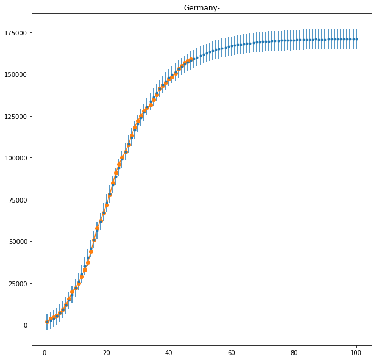


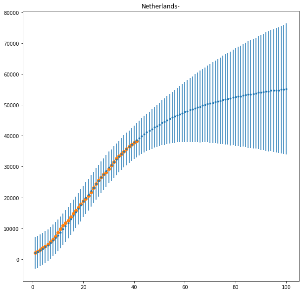


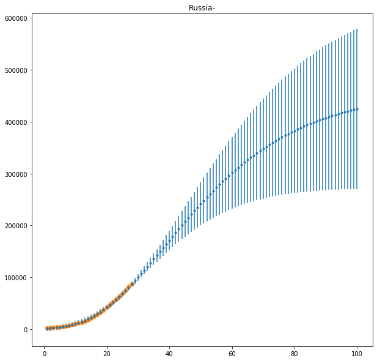


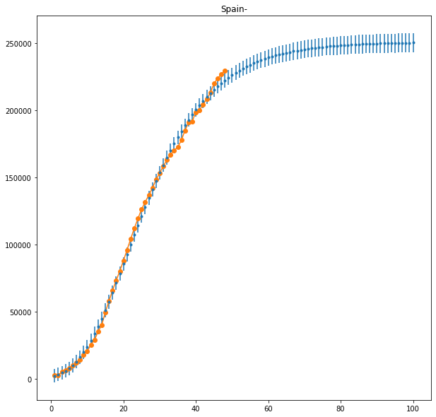


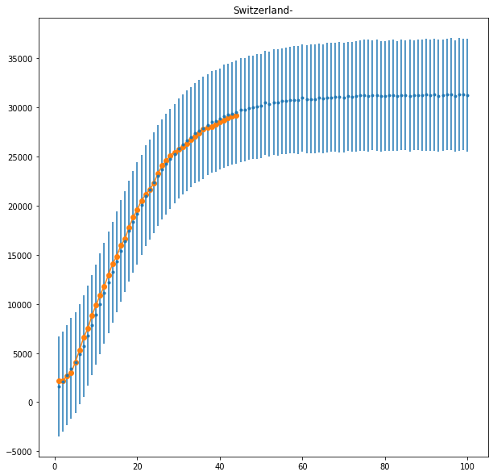


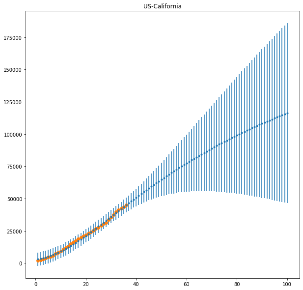


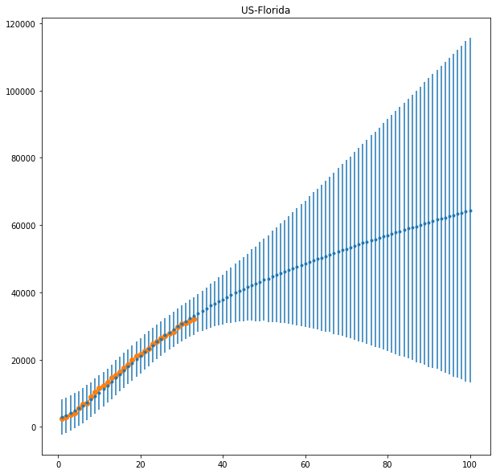


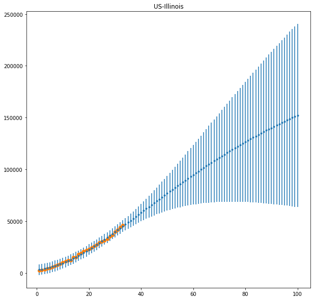


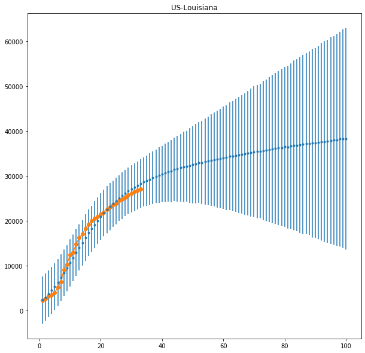


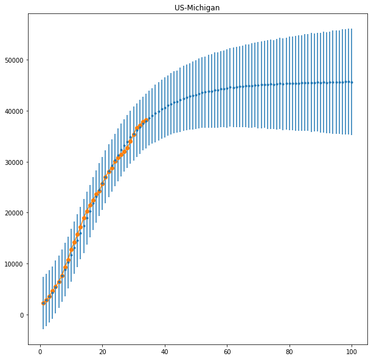


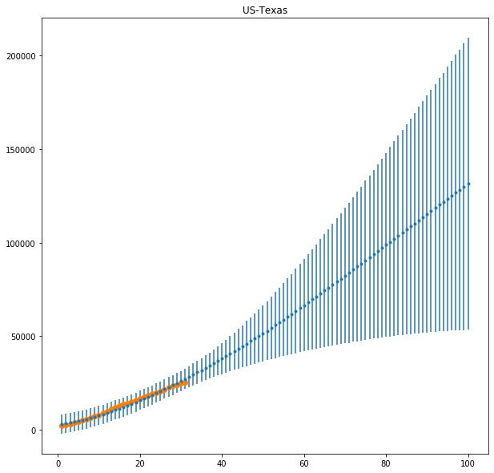


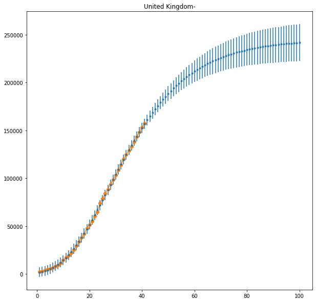


```python

```


```python

```
