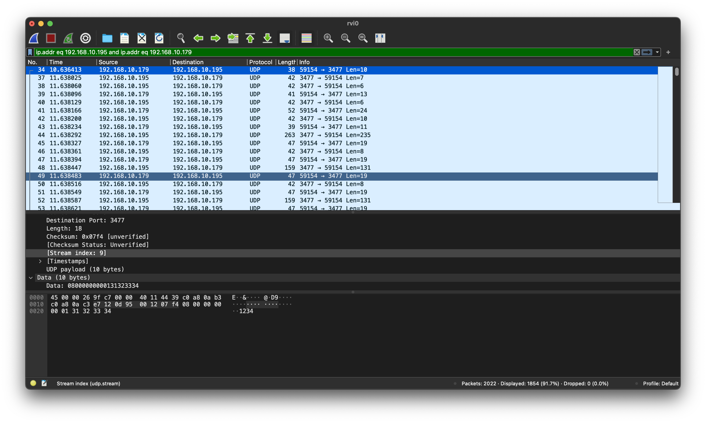
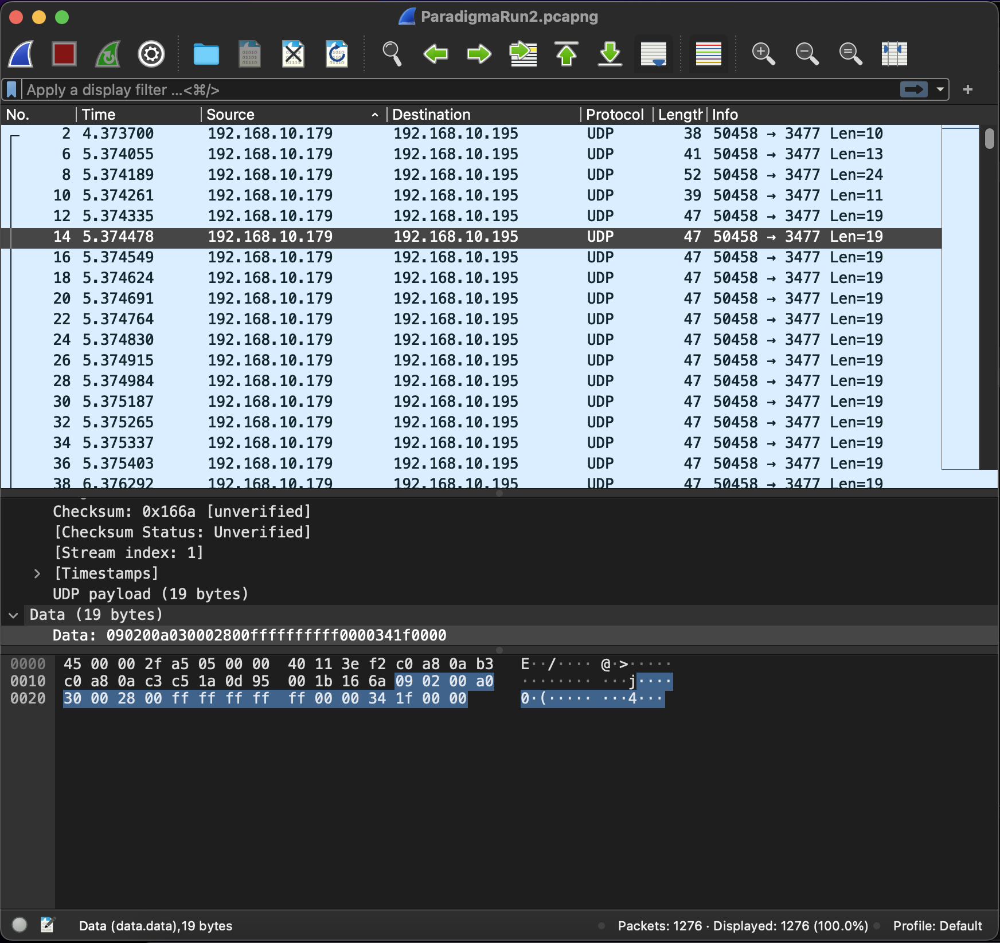

## Introduction
In 2022 we installed a new heating in our house, including panels for solar thermal energy. The manufacturer Paradigma, (I'm in no way related with them and I also do not take any responsibility for any experiments you might be doing based on this) built a nice controller the Systacomfort II, which actually has an onboard ethernet jack.
As the data nerd that I am I was curious to log the information from the system and look at it over time. Excited that there was an ethernet plug on the controller board I thought this would be directly accessible. However as it turned out, the manufacturer of the system prefers their customers to have a subscription for logging the data and giving access to it based on that. The only alternative access was via an app, that only extracted the current state of the system, but didn't allow longer term data logging.

Since I'm not a fan to buy a subscription to see data that actually is generated by something I own, it got me thinking whether it is possible to reverse engineer the communication of the app.

## Getting access to the network traffic

The first difficulty in this project was to get access to the network traffic of the app, to actually see how it communicates with the heating controller.
Since I'm working with an iPhone I didn't have tools directly on the phone to track the network traffic, but on the other hand Apple provides some tools for developing, one is setting up remote virtual network interfaces.
With a working install of the xcode tools, it is possible to proxy the network traffic of the iPhone via a mac computer where it is accessible as a seperate interface then. The tool to do this is 
```
/Library/Apple/usr/bin/rvictl -s <UID_OF_IPHONE>
```
Which will create a new network interface "rvi0" on your computer.
The UID of the iPhone is visible in the device settings in XCode.

With this information at hand it was now possible to really access the traffic of the iPhone directly on the Mac. 

## Logging the communication

Since I wanted to log the communication with the heating, but the iPhone is also communicating with a lot of other network devices at the same time I looked up the IP of[](obsidian://open?vault%3DArticles%26file%3DScreenshot%202022-06-05%20at%2017.10.06.png) the heating controller the App was going to talk to and noted it down.

In the following step I then used Wireshark to log traffic on the interface '''rvi0''' with the IP of the heating controller.
Keeping fingers crossed I opened the app on the iPhone for accessing the heating control... and indeed! The data was coming in and I was able to see the communication between the devices.


## Reverse Engineering the communication

The next task was then to understand the communication between the App and the heating controller and see if it is possible to replicate this in a seperate program, that would then allow me to store the information.

### Establishing a connection
The first observation after running the app multiple times was, that every start shared the same sequence of messages.
A connection seemed to be initiated by the App with a 10 byte long message, followed by some other communication then going forth and back.

Interesting in the first message is, that it always ended with the ASCII characters 1234:
```
0000   08 00 00 00 00 01 31 32 33 34                     ......1234
```
This looked not like random but more like a simple "authentication" with the most used pin (google for it, 1234 accounts for 10% of all used PINs...)

This message is answered by a first messag by the heating:
```
0000   08 00 00 00 00 01 01                              .......
```
and then a second (and if the App doesn't reply more will be sent but slightly modified every time) 
```
0000   01 00 00 d8 46 f0                                 ....F.
```
With the App then answering with something like:
```
0000   01 00 00 d8 46 f0 01 16 00 01 14 00 02            ....F........
```

And a few more interactions happen.

In the end of the initialization phase, the Heating Controller will send the current display values to the app, and continue to repeat sending this.

### What happened in the initialization:
One very interesting part that became clear in the initialization already was the fact, that the App - whenever it send a request after the first steps of the initialization - was using the first 5 bytes of the last controller message.
This turned out to be true for the whole rest of the communication, therefore I call these first 5 bytes "token". Since the whole communication is on UDP, this is probably serving the purpose of keeping session information alive (especially since experiments suggested, that the app is really following a state of the controller and is not able to just request any information it wants, but is restricted to use the "menu" provided by the controller.

### Extracting information

Continuing the investigation of the communication, at some point I was able to see the controller send the information of the current state to the App:
```
0000   09 04 00 8c 47 80 0a 00 16 06 00 91 ff 02 a2 05   ....G...........
0010   ff ff 04 00 00 06 04 0a 00 00 00 00 3f 01 ef 00   ............?...
0020   02 a3 0d 1b 00 1f 00 00 0a 0d e0 00 1f 00 00 0d   ................
0030   02 81 0a 0a 00 6a 00 2c 01 6a 00 0a 0a 00 b8 00   .....j.,.j......
0040   2c 01 b8 00 02 83 12 0a 00 91 00 49 6e 6e 65 6e   ,..........Innen
0050   00 12 0a 00 cc 00 41 75 df 65 6e 00 90 0b 3c 00   ......Au.en...<.
0060   11 00 2c 01 2d 00 90 1e 00 00 00 00 3f 01 ef 00   ..,.-.......?...
0070   02 93 12 2c 01 56 00 31 39 3a 32 33 00 02 92 0a   ...,.V.19:23....
0080   c8 00 4a 00 01 01 62 00 02 93 06 06 12 2c 01 94   ..J...b......,..
0090   00 20 20 32 37 2c 31 20 b0 43 00 02 92 0a 5b 00   .  27,1 .C....[.
00a0   7c 00 77 00 ad 00 02 93 06 04 12 2c 01 cb 00 20   |.w........,... 
00b0   20 31 37 2c 33 20 b0 43 00 02 92 0a dd 00 c0 00    17,3 .C........
00c0   e8 00 d7 00 02 93 02 83 12 0a 00 56 00 4d 69 20   ...........V.Mi 
00d0   20 38 2e 20 4a 75 6e 69 20 32 30 32 32 00 02 82    8. Juni 2022...
00e0   0a 8b 00 4a 00 aa 00 62 00 02 83                  ...J...b...

```

So there it was, I was able to get the first simple information from the heating controller. Now the task was to see if I can get more information than just the room and outside temperature. I was especially interested in the solar thermal panels.

### Reverse Engineering the Menu

to continue I used the App a bit, following a clear plan: cycling through the different views with information I was interested in.
After that I looked at the logs in Wireshark to deduce what was happening.
The first insight was: all messages by the client (after the initial connection) seemed to have a very specific byte format:



Every single message seemed to be of 19 bytes length.
One such sample message was:
```
0000   09 a7 04 6a 43 00 14 00 ff ff ff ff ff 00 00 61   ...jC..........a
0010   1f 00 00                                          ...
```

When looking at all the different messages, it also became obvios, that bytes 9-13 were almost always '''ff''' and only a few times different from that. In addition to that, byte 7 was alternating between a few values and byte 16 as well. Byte 17 also changed only very rarely its value. So what do these values mean?

I'm not entirely sure of all the meanings yet, but the interesting part was that bytes 9-13 changed a few times away from ff. Interestingly this always happened when a new screen was being shown next on the App, so it had something to do with the call to a new screen.
In addition to that it was also interesting to look at how the values changed in this case. The interesting part were bytes 10-13, which actually seemed to increase first the first two values and then the first two bytes got lower again but bytes 3 and 4 were increasing with then the first bytes again. It was almost as if something was counting. Also the increments were not entirely evenly spaced, but had small fluctuations...
Alsmost as if it's not counting but some position. So I developed the hypothesis, that the bytes 9-13 were reflecting the tap position in the current screen when triggering a screen change in the app.
To verify this, I tapped the same icon multiple times on different positions and it seemed to validate my assumption.
In addition to this, byte 7 and 9 seemed to behave always the same when going to the same view and the same was true for byte 17.

This actually seemed to be pretty much all I needed to write a first prototype for doing the communication with the app.
I wrote this in python and indeed I was able to access the information for the first few screens based on these observations, using the observed values from the App communication extracted in Wirehark.

I didn't find any shortcuts, to go from one sub-menu directly to another one, but for now I am quite happy with this solution, which is a python script that runs periodically asking the heating control for the correct information.

### Building a tool for extracting the information

In the end I built a python script for pulling the data periodically and directly writing it into an InfluxDB I host, so that I can collect and analyze historical data on my own premises.
The code can be found under https://github.com/kayr7/ParadigmaHeatingReader

