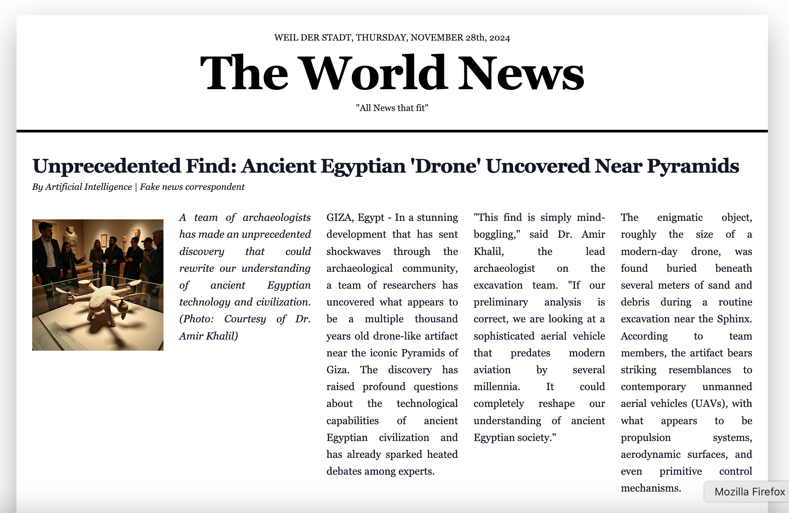
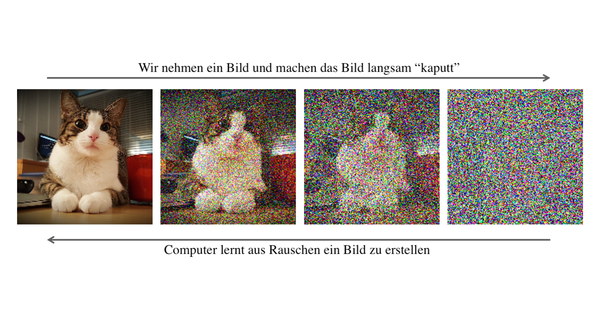

# Were There Already Drones in Ancient Egypt?

## Opening Song

::: notes

- quick intro
- I've been working with AI for almost 20 years
- today I want to introduce the topic a bit and also warn about caution

:::

---

## Fantastic Find in Egypt

- An ancient drone was found near the pyramids!
  {.inline-image-small}
- Now on display in the Egyptian Museum
  {.inline-image-large}

::: notes

- 04:00
- Photo of the researchers who excavated the drone
- now on display in the museum
- what do you notice about this?

:::

---

## Newspapers Report on Sensational Find

{style="display: block; margin: 0 auto;"}

::: {.stamp .fragment data-fragment-index="1"}
FAKE
:::

::: notes

- 07:00
- all of this is not real!
- the images are not real photos, but were generated by a computer! Even the little welcome song was generated by a computer - including the singing.

:::

---

## What is Artificial Intelligence Actually?

- Remarkable: there isn't really a fixed description!
- 
Wikipedia: Property [...] that enables a being to act appropriately and with foresight in its environment

Playing

Conversing

Being Creative

Research

Building

Teamwork

::: notes

- 11:00
- let children tell: what is artificial intelligence for you?
- A LOT has changed in the last 2 years
- very current research
- earlier often "classification" (is there a cat in the picture?)
- today: "describe what can be seen in the picture"

:::

# Generative Artificial Intelligence   
"Computers Creating Something New"

## Computers Can Generate Text

<ul>
<li class="fragment" data-fragment-index="1">Automatically write weather forecasts</li>
<li class="fragment" data-fragment-index="2">Create summaries</li>
<li class="fragment" data-fragment-index="3">Translate texts</li>
<li class="fragment" data-fragment-index="4">Answer questions</li>
<li class="fragment" data-fragment-index="5"><strong>almost indistinguishable from human-written texts</strong></li>
</ul>

  
{.fragment}

::: notes

- 13:00
- Demo
- But also risks:
  - what if the question shouldn't be answered?
  - Write fake news with lies about politicians / people / and others
  - how to build a bomb, write a nasty text about a politician etc.

:::

---

## The Computer Can "Speak" - Even with Any Voice

- For people who lose their voice due to illness
- Movies in other languages with the "original" actor's voice
- Simultaneous translation
- Audiobooks
- "Reading textbooks"
- "Telephone robots"

  <audio controls>
    <source src="Halloo-Mein Name ist Ky 2.wav" type="audio/wav">
  </audio> 

  <audio controls>
    <source src="Hello everybody I-m real 1.wav" type="audio/wav">
  </audio>

 
  <audio controls>
    <source src="Dies habe ich niemals ges 3.wav" type="audio/wav">
  </audio> 

::: notes

- 16:00
- Stephen Hawking?
- Can this be misused?

:::

---

## Images Can Be Modified

Automatically edit photos (closed eyes, distracting trash on the dream beach...)

**Your uploaded images can be easily modified!**

{style="width: 300;"}

::: notes

- 20:00
- do you see a danger?
- every image you put anywhere on the internet can be modified!

:::

---

## Videos Can Also Be Generated by Computers

- Videos can be "invented" in a very short time
- For example, for advertising, no expensive filming locations needed
- Special effects

  <video class="fragment" style="flex 1;" loop muted playsinline controls width="500" height="600">
    <source src="DroneVideo.mp4" type="video/mp4">
    Your browser does not support the video tag.
  </video>
  <video class="fragment" style="flex 1;" loop muted playsinline controls width="500" height="600">
    <source src="ichAstronautVideo.mp4" type="video/mp4">
    Your browser does not support the video tag.
  </video>
  <video class="fragment" style="flex 1;" loop muted playsinline controls width="500" height="600">
    <source src="GoogleVideo.mp4" type="video/mp4">
    Your browser does not support the video tag.
  </video>

::: notes 

- 21:00
- Many people consider videos more credible
- fake videos can influence many people

:::

---

## Music

- Music can be easily generated through descriptions
- Background music in films, series, etc.
- Video games need sound effects / entire teams for music
- 

::: notes 

- 22:00
- Things quickly sound "similar" or familiar

:::

# How Does This Actually Work?

---

## How Can a Computer Generate Text?

- Game: what's the next word?
  - One person starts and says a word, and another child says the following word, and so on.
  - Tomorrow morning I will go to ???
  - My favorite food is ???
  - Yesterday I was at the cinema with ???
  - Tim is a good friend. For example, yesterday I was at the cinema with ???

::: notes 

- 26:00

:::

---

## How Do We Know Which Words Follow?

We have a "feeling" about how a sentence continues
- developed through lots of listening,  speaking and reading

::: notes 

- 29:00

:::

---

## This Also Works with Computers...

<ul>
<li class="fragment" data-fragment-index="1">Computers can "read" - let's give them lots to read, for example the "Internet".</li>
<li class="fragment" data-fragment-index="2">The entire Internet (~150 Zettabytes) printed on A4 paper placed side by side would reach to distant stars (more than 600 light years away!)</li>
<li class="fragment" data-fragment-index="3">about 42 million times the distance from Sun to Earth!</li>
<li class="fragment" data-fragment-index="4">Currently, models are "trained" on about as much as would reach to the moon 4 times</li>
<li class="fragment" data-fragment-index="5"><strong>STILL: The computer only learns to predict the next word!</strong></li>
</ul>

::: notes

- 31:00
a human reads maybe 2GB in their lifetime. 
-> 400,000 pages
-> that's about 84km... about the distance to Ulm...
with listening and speaking about 250km (Stuttgart Frankfurt)
- This also means humans are very efficient!!

:::

---

## Very Similar with Music

<ul>
<li class="fragment">The computer "listens" to all the music in the world</li>
<li class="fragment">It "learns" how a piece of music continues</li>
<li class="fragment">Creating music: Start with any note and then keep generating the next one</li>
<li class="fragment">Keep checking what notes have already been played so it "sounds good"</li>
<li style="padding-top: 1em" class="fragment">But: "sounding good" in this case means "like what it learned"</li>
<li class="fragment">Many computer-generated songs sound familiar</li>
</ul>

::: notes 

- 33:00
- There are already first lawsuits / statements from musicians prohibiting the use of their music or voice
- There are also artists who are already deliberately using AI for their own music.

:::

---

## How Do We Make Art?

 
How can you draw?
 
     
 
How do you carve an owl?
 
     
 
 
simplest approach: start rough, and then make it increasingly refined.

::: notes 

- 35:00

:::

---

## And in the Computer?

- The computer learns to generate images from "noise"

::: notes 

- 37:00
- For this, you take an image
- pick points in the image and "randomize" a new color
- This is given to the computer in reverse order
- The computer learns to generate the image from noise again

:::

---

## Example

::: notes 

- 39:00

:::

---

## But... AI is Not Perfect and Makes Mistakes!

The computer "learns things by heart".

The computer "hallucinates".

  Man, goat, cabbage head and wolf need to cross river, the boat can only fit two things at a time. 
<video controls height="400">
    <source src="./EnManGoatCabbageWolf.mov" />
</video>

  Man and goat need to cross river, the boat can only fit two things at a time. 
<video controls height="400">
<source src="./EnManGoat.mov" />
</video>

  What was Sandra Einstein's profession? 
<video controls height="400">
<source src="./EnSandraEinstein.mov" />
</video>

::: notes 

- 42:00
- Hallucinates
  - There is no half-sister named Indrina Potter in Harry Potter

:::

# How Can We Detect AI-Generated Content?

## How Can We Distinguish Real from AI-Generated Content?

- **Don't believe everything**
- Where does the information come from (known newspaper? Someone on TikTok?)
- Who benefits if this were true?
- Are there other sources?
- "Does it make sense?"

::: notes 

- 44:00

:::

---

## Signs of AI-Generated Content

<ul>
<li class="fragment" data-fragment-index="1">Images</li>
<ul>
<li class="fragment" data-fragment-index="2">unnatural details (hands, ears, hair)</li>
<li class="fragment" data-fragment-index="2">text</li>
<li class="fragment" data-fragment-index="2">logic errors (reflections, strange details)</li>
<li class="fragment" data-fragment-index="2">"too perfect" (soft images, "10 past 10")</li>
</ul>
<li class="fragment" data-fragment-index="3">Videos</li>
<ul>
<li class="fragment" data-fragment-index="4">things disappear or appear</li>
<li class="fragment" data-fragment-index="4">flickering</li>
</ul>
<li class="fragment" data-fragment-index="5">Texts</li>
<ul>
<li class="fragment" data-fragment-index="6">very superficial, formal, apologetic</li>
</ul>
</ul>

::: notes

- 49:00

:::

---

## Which Photo is Real? {.slide-title}

(Encyclopedia Brittannica:   <a href="https://elearn.eb.com/real-vs-ai-images/">https://elearn.eb.com/real-vs-ai-images/</a>)

::: notes

- 50:00

:::

---

## Welches Foto ist echt? {.slide-title}

(Encyclopedia Britannica:   <a href="https://elearn.eb.com/real-vs-ai-images/">https://elearn.eb.com/real-vs-ai-images/</a>)

::: notes

- 51:00

:::

---

## Which Photo is Real? {.slide-title}

(Encyclopedia Britannica:   <a href="https://elearn.eb.com/real-vs-ai-images/">https://elearn.eb.com/real-vs-ai-images/</a>)

::: notes

- 52:00

:::

---

## Which Photo is Real? {.slide-title}

(Encyclopedia Britannica:   <a href="https://elearn.eb.com/real-vs-ai-images/">https://elearn.eb.com/real-vs-ai-images/</a>)

::: notes

- 53:00

:::

---

## Which Photo is Real? {.slide-title}

(Encyclopedia Britannica:   <a href="https://elearn.eb.com/real-vs-ai-images/">https://elearn.eb.com/real-vs-ai-images/</a>)

::: notes

- 54:00

:::

---

## Which Photo is Real? {.slide-title}

(Encyclopedia Britannica:   <a href="https://elearn.eb.com/real-vs-ai-images/">https://elearn.eb.com/real-vs-ai-images/</a>)

::: notes

- 55:00

:::

---

## Which Photo is Real? {.slide-title}

(Encyclopedia Britannica:   <a href="https://elearn.eb.com/real-vs-ai-images/">https://elearn.eb.com/real-vs-ai-images/</a>)

::: notes

- 56:00

:::

---

## Which Photo is Real? {.slide-title}

(Encyclopedia Britannica:   <a href="https://elearn.eb.com/real-vs-ai-images/">https://elearn.eb.com/real-vs-ai-images/</a>)

::: notes

- 57:00

:::

---

## Summary

- Artificial Intelligence offers many possibilities
- It can create images, texts, videos, music, speech, etc.
- But it also makes mistakes 
- It can also deceive
- Be critical when you see something on the Internet / TV!

::: notes

- 59:00
- suddenly I can make images for lectures
- suddenly I can make music
- speak other languages

:::

---

## Thank You   don't believe everything you see or hear on screen

::: notes

- 60:00

:::