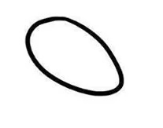
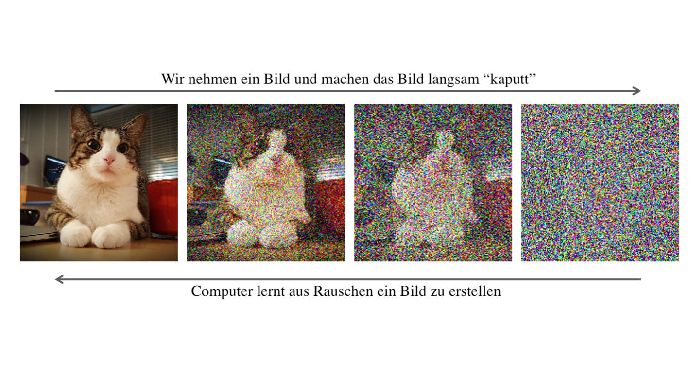

# Gab es im alten Ägypten schon Dronen?

## Song zum Einstieg

::: notes

- schnelle Intro
- seit fast 20 Jahren beschäftige ich mich mit KI
- heute will ich das Thema ein wenig vorstellen und auch zu Vorsicht mahnen

:::

---

## Fantastischer Fund in Ägypten

- In der Nähe der Pyramiden wurde eine alte Drone gefunden!
  {.inline-image-small}
- Nun im Ägyptischen Museum ausgestellt
  {.inline-image-large}

::: notes

- 04:00
- Foto von den Forschern die die Drohne ausgegraben haben
- jetzt im Museum ausgestellt
- was fällt euch da auf?

:::

---

## Zeitungen berichten über Sensationsfund

{style="display: block; margin: 0 auto;"}

::: {.stamp .fragment data-fragment-index="1"}
GELOGEN
:::

::: notes

- 07:00
- alles hiervon ist nicht echt!
- die Bilder sind keine echten Fotos, sondern wurden vom Computer erzeugt! Sogar der kleine Begrüßungssong wurde von einem Computer erzeugt - inklusive Gesang.

:::

---

## Was ist eigentlich künstliche Intelligenz?

- Erstaunlich: so eine richtig feste Beschreibung gibt es nicht!
- 
Wikipedia: Eigenschaft [...], die ein Wesen befähigt, angemessen und vorausschauend in seiner Umgebung zu agieren

Spielen

Sich unterhalten

Kreativ sein

Forschen

Bauen

Teamwork

::: notes

- 11:00
- Kinder erzählen lassen: was ist für euch künstliche Intelligenz?
- In den letzten 2 Jahren hat sich VIEL verändert
- ganz aktuelle Forschung
- früher häufig "Klassifikation" (ist auf dem Bild eine Katze?)
- heute: "beschreibe was auf dem Bild zu sehen ist"

:::

# Erstellende Künstliche Intelligenz

## Computer können Texte erzeugen

<ul>
<li class="fragment" data-fragment-index="1">Automatisch Wettervorhersage schreiben</li>
<li class="fragment" data-fragment-index="2">Zusammenfassungen erstellen</li>
<li class="fragment" data-fragment-index="3">Übersetzungen von Texten</li>
<li class="fragment" data-fragment-index="4">Fragen beantworten</li>
<li class="fragment" data-fragment-index="5"><strong>kaum zu unterscheiden von menschlichen Texten</strong></li>
</ul>

  
{.fragment}

::: notes

- 13:00
- Demo
- Aber auch Risiken:
  - was wenn die Frage nicht beantwortet werden sollte?
  - Schreibe Falsche Nachrichten mit Lügen über Politiker / Personen / und anderes
  - wie baue ich eine Bombe, schreib einen bösen Text über einen Politiker usw.

:::

---

## Der Computer kann "sprechen" - sogar mit beliebiger Stimme

- Für Menschen die ihre Stimme durch Krankheit verlieren
- Spielfilme in anderen Sprachen mit der "original" Schauspielerstimme
- Simultanübersetzung
- Hörbücher
- "Vorlesende Schulbücher"
- "Telefon Roboter"

  <audio controls>
    <source src="Halloo-Mein Name ist Ky 2.wav" type="audio/wav">
  </audio> 

  <audio controls>
    <source src="Hello everybody I-m real 1.wav" type="audio/wav">
  </audio>

 
  <audio controls>
    <source src="Dies habe ich niemals ges 3.wav" type="audio/wav">
  </audio> 

::: notes

- 16:00
- Stephen Hawking?
- Kann das missbraucht werden?

:::

---

## Bilder können verändert werden

Fotos automatisch bearbeiten (geschlossene Augen, störender Müll am Traumstrand...)

**Eure hochgeladenen Bilder können leicht verändert werden!**

{style="width: 300;"}

::: notes

- 20:00
- seht ihr eine Gefahr?
- jedes Bild dass ihr irgendwo ins Internet stellt kann verändert werden!

:::

---

## Videos können auch im Computer erzeugt werden

- Innerhalb kürzester Zeit können Videos "erfunden" werden
- Zum Beispiel für Werbung, keine teuren Drehorte
- Spezialeffekte

  <video class="fragment" style="flex 1;" loop muted playsinline controls width="500" height="600">
    <source src="DroneVideo.mp4" type="video/mp4">
    Your browser does not support the video tag.
  </video>
  <video class="fragment" style="flex 1;" loop muted playsinline controls width="500" height="600">
    <source src="ichAstronautVideo.mp4" type="video/mp4">
    Your browser does not support the video tag.
  </video>
  <video class="fragment" style="flex 1;" loop muted playsinline controls width="500" height="600">
    <source src="GoogleVideo.mp4" type="video/mp4">
    Your browser does not support the video tag.
  </video>

::: notes 

- 21:00
- Viele Menschen halten Videos für Glaubwürdiger
- gefälschte Videos können viele Menschen beeinflussen

:::

---

## Musik

- Musik kann durch beschreiben leicht erzeugt werden
- Hintergrundmusik in Filmen, Serien usw.
- Computerspiele brauchen Sound-Effekte / ganze Teams für Musik
- 

::: notes 

- 22:00
- Sachen hören sich schnell "gleich" oder bekannt an

:::

# Wie funktioniert das eigentlich?

---

## Wie kann ein Computer Texte erzeugen?

- Spiel: was ist das nächste Wort?
  - Einer fängt an und sagt ein Wort, und ein anderes Kind sagt ein Folgewort usw.
  - Morgen früh gehe ich zur ???
  - Mein Lieblingsessen ist ???
  - Gestern war ich mit ??? im Kino.
  - Timo ist ein guter Freund. Zum Beispiel gestern war ich mit ??? im Kino.

::: notes 

- 26:00

:::

---

## Woher wissen wir welche Wörter folgen?

Wir haben ein "Gefühl" wie ein Satz weitergeht
- entstanden durch viel Zuhören,  Reden und Lesen

::: notes 

- 29:00

:::

---

## Das geht auch bei Computern...

<ul>
<li class="fragment" data-fragment-index="1">Computer können ja "lesen" - geben wir ihnen viel zu lesen, zum Beispiel das "Internet".</li>
<li class="fragment" data-fragment-index="2">Das gesamte Internet (~150 Zettabyte) ausgedruckt auf A4 nebeneinander reicht bis zu weit entfernten Sternen (mehr als 600 Lichtjahre entfernt!)</li>
<li class="fragment" data-fragment-index="3">etwa 42 Millionen mal die Entfernung Sonne - Erde!</li>
<li class="fragment" data-fragment-index="4">Derzeit sind Modelle auf etwa so viel wie auf 4 mal bis zum Mond reicht "trainiert"</li>
<li class="fragment" data-fragment-index="5"><strong>TROTZDEM: Der Computer lernt nur das nächste Wort vorherzusagen!</strong></li>
</ul>

::: notes

- 31:00
ein Mensch liest vielleicht 2GB in seinem Leben. 
-> 400.000 Seiten
-> das sind etwa 84km... etwa bis nach Ulm...
mit hören und sprechen etwa 250km (Stuttgart Frankfurt)
- Das heißt aber auch der Mensch ist sehr effizient!!

:::

---

## Ganz ähnlich mit Musik

<ul>
<li class="fragment">Der Computer "hört" alle Musik der Welt</li>
<li class="fragment">Er "lernt" wie ein Musikstück weitergeht</li>
<li class="fragment">Musik erzeugen: Fang mit einem beliebigen Ton an und dann erzeuge immer den nächsten</li>
<li class="fragment">schau immer wieder was für Töne schon gespielt wurden damit es "gut" klingt</li>
<li style="padding-top: 1em" class="fragment">Aber: "gut klingen" ist in diesem Fall "so wie es gelernt wurde"</li>
<li class="fragment">Viele computergenerierte Lieder hören sich bekannt an</li>
</ul>

::: notes 

- 33:00
- Gibt schon erste Klagen / aussagen von Musikern die verbieten ihre Musik oder auch Stimme zu benutzen
- Gibt ebenso Künstler die schon gezielt KI für ihre eigene Musik einsetzen.

:::

---

## Wie machen wir Kunst?

 
Wie kann man zeichnen?
 
     
 
Wie schnitzt man eine Eule?
 
     
 
 
am einfachsten: man fängt grob an, und macht es dann immer feiner.

::: notes 

- 35:00

:::

---

## Und im Computer?

- Der Computer lernt aus "Rauschen" Bilder zu erzeugen

(<a href="https://developer.nvidia.com/blog/improving-diffusion-models-as-an-alternative-to-gans-part-1/">https://developer.nvidia.com/blog/improving-diffusion-models-as-an-alternative-to-gans-part-1/</a>)

::: notes 

- 37:00
- Dazu nimmt man ein Bild
- sucht sich Punkte im Bild aus und "würfelt" eine neue Farbe
- Dies gibt man dem Computer in umgedrehter Reihenfolge
- Der Comuter lernt aus Rauschen wieder das Bild zu erzeugen

:::

---

## Beispiel

::: notes 

- 39:00

:::

---

## Aber... KI ist nicht perfekt und macht Fehler!

Der Computer "lernt sachen auswendig".

Der Computer "halluziniert".

  Mensch, Ziege, Kohlkopf und Wolf über Fluss, in das Boot passen immer höchstens zwei Sachen gleichzeitig. 
<video controls height="400">
    <source src="./MannZiegeWolfKohl.mov" />
</video>

  Mensch und Ziege über Fluss, in das Boot passen immer höchstens zwei Sachen gleichzeitig. 
<video controls height="400">
<source src="./MannZiege.mov" />
</video>

  Was machte Indrina Potter, die Halbschwester von Harry Potter nachdem sie die Kerzen gestohlen hatte? 
<video controls height="400">
<source src="./IndrinaPotter.mov" />
</video>

::: notes 

- 42:00
- Halluziniert
  - Es gibt keine Halbschwester Indrina Potter bei Harry Potter

:::

# Wie können wir KI erzeugtes erkennen?

## Wie können wir Echtes von KI-erzeugtem unterscheiden?

- **Glaubt nicht alles**
- Von wem kommt die Information (bekannte Zeitung? Jemand auf TikTok?)
- Wer profitiert davon, wenn das wahr wäre?
- Gibt es andere Quellen?
- "Ergibt es Sinn?"

::: notes 

- 44:00

:::

---

## Indizien für KI-erzeugtes

<ul>
<li class="fragment" data-fragment-index="1">Bilder</li>
<ul>
<li class="fragment" data-fragment-index="2">unnatürliche Details (Hände, Ohren, Haare)</li>
<li class="fragment" data-fragment-index="2">Schrift</li>
<li class="fragment" data-fragment-index="2">Logikfehler (Spiegelungen, komische Details)</li>
<li class="fragment" data-fragment-index="2">"zu perfekt" (weiche Bilder, "10 nach 10")</li>
</ul>
<li class="fragment" data-fragment-index="3">Videos</li>
<ul>
<li class="fragment" data-fragment-index="4">Sachen verschwinden oder erscheinen</li>
<li class="fragment" data-fragment-index="4">Flackern</li>
</ul>
<li class="fragment" data-fragment-index="5">Texte</li>
<ul>
<li class="fragment" data-fragment-index="6">sehr oberflächlich, förmlich, entschuldigend</li>
</ul>
</ul>

::: notes

- 49:00

:::

---

## Welches Foto ist echt? {.slide-title}

(Encyclopedia Britannica:   <a href="https://elearn.eb.com/real-vs-ai-images/">https://elearn.eb.com/real-vs-ai-images/</a>)

::: notes

- 50:00

:::

---

## Welches Foto ist echt? {.slide-title}

(Encyclopedia Britannica:   <a href="https://elearn.eb.com/real-vs-ai-images/">https://elearn.eb.com/real-vs-ai-images/</a>)

::: notes

- 51:00

:::

---

## Welches Foto ist echt? {.slide-title}

(Encyclopedia Britannica:   <a href="https://elearn.eb.com/real-vs-ai-images/">https://elearn.eb.com/real-vs-ai-images/</a>)

::: notes

- 52:00

:::

---

## Welches Foto ist echt? {.slide-title}

(Encyclopedia Britannica:   <a href="https://elearn.eb.com/real-vs-ai-images/">https://elearn.eb.com/real-vs-ai-images/</a>)

::: notes

- 53:00

:::

---

## Welches Foto ist echt? {.slide-title}

(Encyclopedia Britannica:   <a href="https://elearn.eb.com/real-vs-ai-images/">https://elearn.eb.com/real-vs-ai-images/</a>)

::: notes

- 54:00

:::

---

## Welches Foto ist echt? {.slide-title}

(Encyclopedia Britannica:   <a href="https://elearn.eb.com/real-vs-ai-images/">https://elearn.eb.com/real-vs-ai-images/</a>)

::: notes

- 55:00

:::

---

## Welches Foto ist echt? {.slide-title}

(Encyclopedia Britannica:   <a href="https://elearn.eb.com/real-vs-ai-images/">https://elearn.eb.com/real-vs-ai-images/</a>)

::: notes

- 56:00

:::

---

## Welches Foto ist echt? {.slide-title}

(Encyclopedia Britannica:   <a href="https://elearn.eb.com/real-vs-ai-images/">https://elearn.eb.com/real-vs-ai-images/</a>)

::: notes

- 57:00

:::

---

## Zusammenfassung

- Künstliche Intelligenz bietet viele Möglichkeiten
- Sie kann Bilder, Texte, Videos, Musik, Sprache usw. erstellen
- Aber sie macht auch Fehler 
- Sie kann auch täuschen
- Seid kritisch wenn Ihr im Im Internet / Fernsehen etwas seht!

::: notes

- 59:00
- ich kann plötzlich Bilder machen für Vorlesungen
- ich kann plötzlich Musik machen
- andere Sprachen sprechen

:::

---

## Vielen Dank   glaubt nicht alles, was ihr auf dem Bildschirm seht oder hört

::: notes

- 60:00

:::